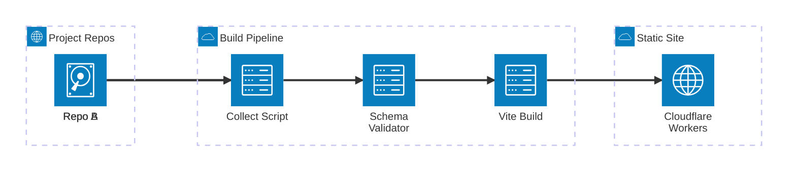

## Context / Problem

Most portfolio sites are monoliths — every project's description, metadata, and media lives in the portfolio repo itself. This creates a maintenance problem: project details go stale because updating them means context-switching into a separate repo, and there's no validation that the content is complete or well-structured.

I wanted each project to own its own presentation, with the portfolio site acting as an aggregator that assembles everything at build time.

## Solution

A React site backed by a build-time data pipeline. Each project repo contains a `PORTFOLIO_PRESENTATION.md` file with YAML front matter for structured metadata and markdown for the narrative body. A prebuild script fetches these files from GitHub, validates them against a JSON Schema, and writes the collected data for Vite to bundle.

### Key design decisions

- **Decoupled data ownership** — projects describe themselves in their own repos, not in the portfolio repo. Updating a project's description is a commit in that project, not here.
- **Schema-validated front matter** — AJV validates every presentation against a strict JSON Schema at build time. Missing fields, bad types, or unknown tags fail the build immediately with clear error messages.
- **Two data modes** — live mode fetches from GitHub (requires a token), mock mode copies sample data for local development with zero setup.
- **Lazy-loaded Mermaid diagrams** — architecture diagrams are code-split and only load when a project actually uses them. Render failures show the source code and error instead of a blank space.
- **Automated rebuilds** — project repos trigger a portfolio rebuild via GitHub Actions repository dispatch when their presentation file changes.

## Architecture

The collect script fetches each presentation via the GitHub API, parses YAML front matter with gray-matter, and validates it with AJV. Valid projects are written to a JSON file that Vite bundles into the React app. The static output deploys to Cloudflare Workers with SPA fallback routing.

## Current State

Live and serving the projects you see on this site. The system works well for a small number of projects. If the project count grows significantly, the build-time fetch approach may need caching or incremental builds to keep deploy times reasonable.
