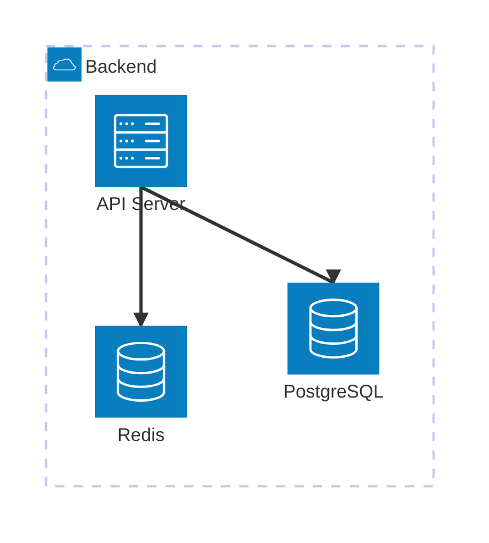

# Portfolio Presentation Template

Create a file called `PORTFOLIO_PRESENTATION.md` in the root of your project repo. The file uses YAML front matter for structured metadata and markdown for the narrative body.

## Template

```markdown
---
id: my-project-name
title: My Project Name
tagline: One-line description of what this project does
status: live          # live | wip | experimental | archived
visibility: public    # public | private
tags:
  - web
  - api
stack:
  - TypeScript
  - React

# Optional fields
role: solo            # solo | team | client
featured: false
timeframe:
  start: "2024-01"
  end: null           # null or "YYYY-MM"
origin: personal      # personal | professional
toc: false            # Show table of contents in detail view

links:
  live: https://example.com
  repo: https://github.com/user/repo
  docs: null
  demo: null
  post: null
  video: null

metrics:
  users: null
  requests_per_day: null
  latency_ms_p95: null
  uptime: null
  notes: null

media:
  cover_image: null
  gallery: []

# For professional work — disclose ownership clearly
attribution:
  ownership: "Company Name — shared with permission"
  context: "Brief context of the work environment"
  my_role: "Your specific contribution"
  team_size: 4
  permissions:
    code_public: false
    screenshots_public: true
    discussion_level: architecture
---

## Context / Problem

What problem does this solve? Why does it exist?

## Solution

How does it work? What are the key features?

## Architecture

Use a Mermaid `architecture-beta` diagram to illustrate the system design. The portfolio renders these as interactive SVG diagrams automatically.

````

````

**Mermaid label restrictions:** The `architecture-beta` parser does not support `/` or `.` characters inside bracket labels. Use alternative wording instead:

| Avoid                  | Use instead          |
| ---------------------- | -------------------- |
| `D3.js Frontend`       | `D3 Frontend`        |
| `Rust/WASM FFT`        | `WASM FFT Module`    |
| `PageRank / Clusters`  | `PageRank Clusters`  |
| `Node.js Server`       | `Node Server`        |

Available icons: `cloud`, `database`, `disk`, `internet`, `server`. Edge directions: `T` (top), `B` (bottom), `L` (left), `R` (right).

## Current State

What's the current status? What's next?
```

## Required Fields

| Field        | Type       | Constraints                          |
| ------------ | ---------- | ------------------------------------ |
| `id`         | string     | Kebab-case (`a-z`, `0-9`, hyphens). Must match `^[a-z0-9]+(-[a-z0-9]+)*$` |
| `title`      | string     | Non-empty                            |
| `tagline`    | string     | Non-empty                            |
| `status`     | enum       | `live`, `wip`, `experimental`, `archived` |
| `visibility` | enum       | `public`, `private`                  |
| `tags`       | string[]   | At least one. See [`docs/tags.md`](tags.md) for the controlled vocabulary |
| `stack`      | string[]   | At least one                         |

## Optional Fields

| Field | Type | Constraints |
| --- | --- | --- |
| `role` | enum | `solo`, `team`, `client` |
| `featured` | boolean | Surfaces the project at the top of the list |
| `origin` | enum | `personal`, `professional` |
| `toc` | boolean | Show table of contents in the detail view |
| `timeframe.start` | string | `YYYY-MM` format (e.g. `"2024-01"`) |
| `timeframe.end` | string \| null | `YYYY-MM` format or `null` for ongoing |
| `links.live` | string \| null | URI — primary live URL |
| `links.repo` | string \| null | URI — source code |
| `links.docs` | string \| null | URI — documentation |
| `links.demo` | string \| null | URI — interactive demo |
| `links.post` | string \| null | URI — blog post or writeup |
| `links.video` | string \| null | URI — video walkthrough |
| `metrics.users` | integer \| null | Active or total user count |
| `metrics.requests_per_day` | integer \| null | Daily request volume |
| `metrics.latency_ms_p95` | number \| null | 95th percentile latency in ms |
| `metrics.uptime` | string \| null | Uptime percentage (e.g. `"99.97%"`) |
| `metrics.notes` | string \| null | Additional context for metrics |
| `media.cover_image` | string \| null | URL to a cover image |
| `media.gallery` | string[] | URLs to additional screenshots |
| `attribution.ownership` | string | Who owns the work and usage permission |
| `attribution.context` | string | Work environment context |
| `attribution.my_role` | string | Your specific contribution |
| `attribution.team_size` | integer | Number of people on the team |
| `attribution.permissions.code_public` | boolean | Whether source code can be shared |
| `attribution.permissions.screenshots_public` | boolean | Whether screenshots can be shown |
| `attribution.permissions.discussion_level` | string | Depth of discussion allowed (e.g. `"architecture"`, `"general"`) |

No additional properties are allowed — the build will reject any field not listed above.

## Validation

Front matter is validated against `schema/portfolio-project.schema.json` at build time. The build will fail if required fields are missing or values don't match the expected format.

## Triggering Updates

When you push changes to `PORTFOLIO_PRESENTATION.md` on `main` or `master`, a GitHub Action can trigger a portfolio rebuild via repository dispatch. See `.github/workflows/trigger-portfolio-template.yml` for the reference workflow.
